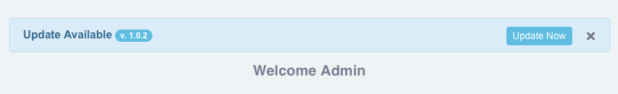

## Author
* **Pietro Cinaglia** - Contact me using [GitHub](https://github.com/pietrocinaglia) or [LinkedIn](https://linkedin.com/in/pietrocinaglia)


# LaraUpdater [ self-update for your Laravel App ]

LaraUpdater allows your Laravel application to auto-update itself ! ;)

When you release an application is most important maintain it; therefore, could be necessary to publish an update for bugs fixing as well as for new features implementation.

You deploy your App for several users:

WITHOUT LaraUpdate => Do you want to contact them one by one and send them the update using an email or a link ? ...mmm...very bad becouse each user (with admin role) have to overwrite manually all files on his deployment; or, you have to access manually all deployments (e.g. using FTP) and install for them the update.

#### WITH LaraUpdater => Let your application (ALONE) detects that a new update is available and notifies its presence to the administrator; furthermore, let your application install it and handles all related steps.


### NEW VERSION change-log 
- Now it supports Laravel 8 and 9;
- New view based on Bootstrap 5;
- Bugs Fix.


## Features:

#### > Self-Update
LaraUpdater allows your Laravel Application to self-update :)
Let your application (ALONE) detects that a new update is available and notifies its presence to the administrator; furthermore, let your application install it and handles all related steps.

#### > Maintenance Mode
LaraUpdate activates the maintenance mode (using the native Laravel command) since the update starts until it finishes with success.

#### > Security
You can set which users  (e.g. only the admin) can perform an update for the application; this parameter is stored in the `config/laraupdater.php` so each application can sets its users indipendently. Furthermore, LaraUpdater is compatible with Laravel-Auth.

#### > Fault tolerant
During the update LaraUpdate BACKUPS all files that are overwritten, so if an error occurs it can try to restore automatically the previous state. If the restoring fails, you can use the backup stored in the root of your system for a manual maintenance.

#### > Supports PHP script
LaraUpdate can import a PHP script to perform custom actions (e.g. create a table in database after the update); the commands are performed in the last step of update.

#### > Backup/Recovery Integrated

#### > Multi-language


## Getting Started

These instructions will get you a copy of the project up and running on your server for development and testing purposes.

### Prerequisites

LaraUpdater has been tested using Laravel 8/9
Recommended Laravel Version >= 8


## Installing

This package can be installed through Composer:
```
composer require pcinaglia/laraupdater
```

After installation you must perform these steps:

#### 1) add the service provider in `config/app.php` file:

```
'providers' => [
    // ...
    pcinaglia\laraupdater\LaraUpdaterServiceProvider::class,
];
```

#### 2) publish LaraUpdater in your app
This step will copy the config file in the config folder of your Laraver App.

```
php artisan vendor:publish --provider="pcinaglia\laraupdater\LaraUpdaterServiceProvider"
```

When it is published you can manage the configuration of LaraUpdater through the file in `config/laraupdater.php`, it contains:

```
    /*
    * Temporary folder to store update before to install it.
    */
    'tmp_folder_name' => 'tmp',

    /*
    * Script's filename called during the update.
    */
    'script_filename' => 'upgrade.php',

    /*
    * URL where your updates are stored ( e.g. for a folder named 'updates', under http://site.com/yourapp ).
    */
    'update_baseurl' => 'http://localhost:8888/update',

    /*
    * Set a middleware for the route: updater.update
    * Only 'auth' NOT works (manage security using 'allow_users_id' configuration)
    */
    'middleware' => ['web', 'auth'],

    /*
    * Set which users can perform an update; 
    * This parameter accepts: ARRAY(user_id) ,or FALSE => for example: [1]  OR  [1,3,0]  OR  false
    * Generally, ADMIN have user_id=1; set FALSE to disable this check (not recommended)
    */
    'allow_users_id' => [1] 
```

#### 3) Create version.txt
To store current version of your application you have to create a text file named `version.txt` and copy it in the main folder of your Laravel App.
For example, create a .txt file that contains only:
```
1.0
```
Use only 1 row, the first, of the .txt file.
When release an update this files is updated from LaraUpdate.


## Create your update "repository"

#### 1) Create the Archive
Create a .zip archive with all files that you want replace during the update (use the same structure of your application to organize the files in the archive).

#### 1.1) Upgrade Script (optional)
You can create a PHP file named `upgrade.php` to perform custom actions (e.g. create a new table in the database).
This file must contain a function named `main()` with a boolean return (to pass the status of its execution to LaraUpdater), see this example:
```
<?php

function main(){

	example:
        command-1-to-connect-db
	    command-2-to-create-table
	    command-3-to-insert-data
	
	return true;
}
?>
```
Note that the above example does not handle any exceptions, so the status of its execution return always true (not recommended).


#### 2) Set the Metadata for your Update:

Create a file named `laraupdater.json` like this:
```
{
	"version": "1.0.2",
	"archive": "RELEASE-1.02.zip",
	"description": "Minor bugs fix"
}
```
`archive` contains the name for the .zip Archive (see Step-1).


#### 3) Upload your update

Upload `laraupdater.json` and .zip Archive in the same folder of your server (the one that will host the update).

	
#### 4) Configure your application

Set the server that will host the update in `config/laraupdater.php` (see Installing):

For example, if you upload files under:

	http://yoursites.com/updatesformyapp/RELEASE-1.02.zip
	and http://yoursites.com/updatesformyapp/laraupdater.json

set `'update_baseurl'` as follows: `'update_baseurl' => 'http://yoursites.com/updatesformyapp',`


## Usage

LaraUpdater implements three main methods that you can call using the routes:

#### updater.check
Returns '' (an update not exist) OR $version (e.g. 1.0.2, if an update exist).

#### updater.currentVersion
Returns the current version of your App (from `version.txt`).

#### updater.update
It downloads and installs the last update available.
This route is protected using the information under `'allow_users_id'` in `config/laraupdater.php`


I suggest, to not use directly these routes BUT to show an Alert when an update is available; the Alert could be contain a Button to perform the update, see the solution below:


### Notification popup by using Bootstrap 5 and JQuery (included)



Add to `resources/view/layout/app.blade.php` this code to load the view included in LaraUpdater (I suggest immediately before of `@yield('content')`):
```
@include('vendor.laraupdater.notification')       
```

TEST: publish an update and refresh the page to show the alert :-)


## License

This project is licensed under the MIT License - see the [LICENSE](LICENSE) file for details.

(MIT License - WARRANTY Info) THE SOFTWARE IS PROVIDED "AS IS", WITHOUT WARRANTY OF ANY KIND, EXPRESS OR IMPLIED, INCLUDING BUT NOT LIMITED TO THE WARRANTIES OF MERCHANTABILITY, FITNESS FOR A PARTICULAR PURPOSE AND NONINFRINGEMENT. IN NO EVENT SHALL THE AUTHORS OR COPYRIGHT HOLDERS BE LIABLE FOR ANY CLAIM, DAMAGES OR OTHER LIABILITY, WHETHER IN AN ACTION OF CONTRACT, TORT OR OTHERWISE, ARISING FROM, OUT OF OR IN CONNECTION WITH THE SOFTWARE OR THE USE OR OTHER DEALINGS IN THE SOFTWARE.

